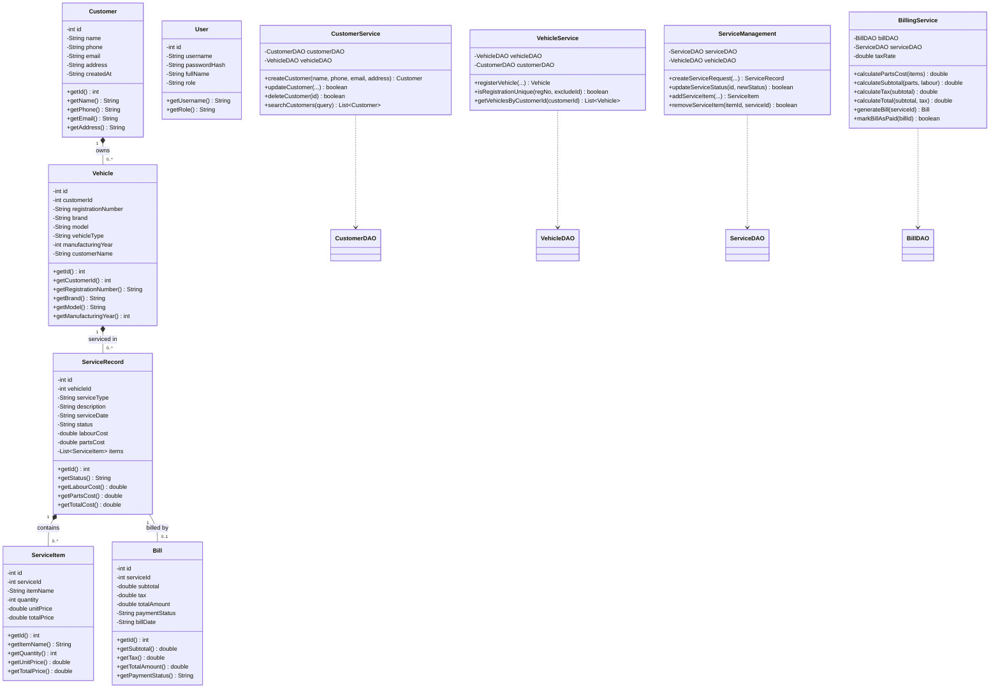

# Class Diagram: Vehicle Service Management System

## Object-Oriented Architecture Diagram
This class diagram highlights the entity models, encapsulations, DAO data access objects, services, and JavaFX controllers.

