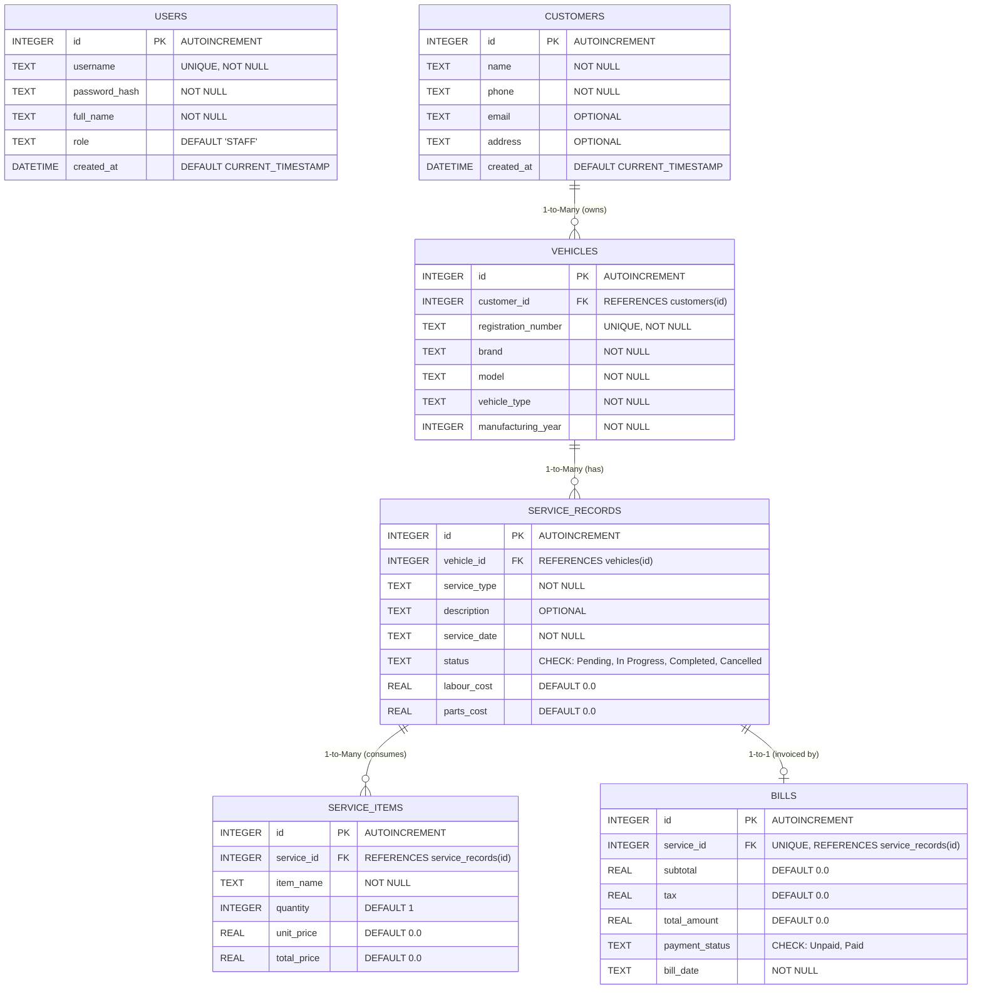

# Entity-Relationship (ER) Diagram: Vehicle Service Management System

## Relational Database Schema
This diagram presents the relational SQLite database entities, primary keys (PK), foreign keys (FK), column attributes, and cardinality constraints.

## Relational Integrity Rules
- **Cascade Deletes**:
  - Deleting a customer cascades to their vehicles, service records, and associated bills.
  - Deleting a service record cascades to its service items and bill record.
- **Uniqueness Constraints**:
  - `vehicles.registration_number` is strictly unique. Duplicate registration attempts are rejected.
  - `bills.service_id` is unique, enforcing the strict 1-to-1 relationship between a service job and its invoice.
  - `users.username` is strictly unique across all staff logins.
- **Check Constraints**:
  - `service_records.status` is restricted to `('Pending', 'In Progress', 'Completed', 'Cancelled')`.
  - `bills.payment_status` is restricted to `('Unpaid', 'Paid')`.
