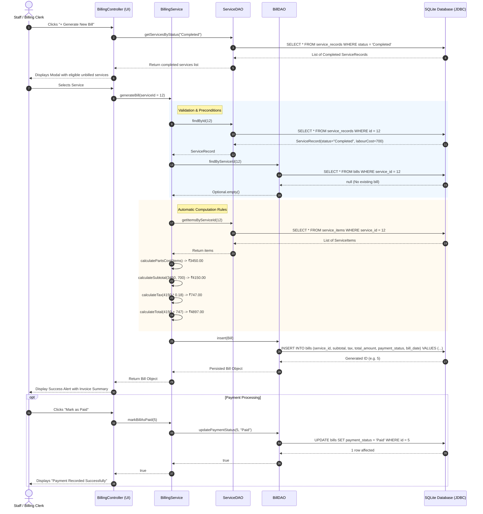

# Sequence Diagram: Vehicle Service Management System

## Scenario: Completing a Service & Generating an Automated Bill
This sequence diagram details the runtime interaction between the Staff Member, `BillingController`, `BillingService`, `ServiceDAO`, `BillDAO`, and the SQLite Database.

