# System Architecture: Vehicle Service Management System

## Architectural Overview
The Vehicle Service Management System is designed using a **Strict 5-Tier Layered Java Architecture**. Each tier maintains clear single responsibilities, promoting high cohesion, low coupling, robust maintainability, and clean academic demonstration of Object-Oriented Design Principles.

```mermaid
graph TD
    subgraph UI_Layer ["1. Presentation Layer (JavaFX)"]
        A1[Main Application Window]
        A2[Login Screen]
        A3[Dashboard & Charts View]
        A4[Customer Management View]
        A5[Vehicle Registry View]
        A6[Service Jobs & Parts View]
        A7[Billing & Invoicing View]
    end

    subgraph Controller_Layer ["2. Controller Layer"]
        C1[LoginController]
        C2[DashboardController]
        C3[CustomerController]
        C4[VehicleController]
        C5[ServiceController]
        C6[BillingController]
    end

    subgraph Service_Layer ["3. Business Logic & Service Layer"]
        S1[AuthService]
        S2[CustomerService]
        S3[VehicleService]
        S4[ServiceManagement]
        S5[BillingService]
        S6[ReportService]
        U1[ValidationUtil]
        U2[ErrorHandler]
    end

    subgraph DAO_Layer ["4. Data Access Object (DAO) Layer"]
        D1[UserDAO]
        D2[CustomerDAO]
        D3[VehicleDAO]
        D4[ServiceDAO]
        D5[BillDAO]
    end

    subgraph DB_Layer ["5. Persistence Layer (Relational SQLite)"]
        DB[(vehicleservice.db<br/>Foreign Keys Enabled<br/>ACID Compliant)]
        T1[users table]
        T2[customers table]
        T3[vehicles table]
        T4[service_records table]
        T5[service_items table]
        T6[bills table]
    end

    UI_Layer --> Controller_Layer
    Controller_Layer --> Service_Layer
    Service_Layer --> DAO_Layer
    DAO_Layer --> DB_Layer

    classDef ui fill:#e0f2fe,stroke:#0284c7,stroke-width:2px,color:#0369a1;
    classDef ctrl fill:#fef3c7,stroke:#d97706,stroke-width:2px,color:#92400e;
    classDef srv fill:#dcfce7,stroke:#16a34a,stroke-width:2px,color:#166534;
    classDef dao fill:#f3e8ff,stroke:#9333ea,stroke-width:2px,color:#6b21a8;
    classDef db fill:#ffe4e6,stroke:#e11d48,stroke-width:2px,color:#9f1239;

    class A1,A2,A3,A4,A5,A6,A7 ui;
    class C1,C2,C3,C4,C5,C6 ctrl;
    class S1,S2,S3,S4,S5,S6,U1,U2 srv;
    class D1,D2,D3,D4,D5 dao;
    class DB,T1,T2,T3,T4,T5,T6 db;
```

## Layer Responsibilities
1. **Presentation Layer (JavaFX)**:
   - Modern, responsive desktop graphical interface styled via external stylesheet (`style.css`).
   - Handles component rendering (`TableView`, `GridPane`, `PieChart`, `BarChart`, `Dialog`).
   - Free of database access and SQL statements.
2. **Controller Layer**:
   - Manages UI events (button clicks, table selection changes, input filters).
   - Coordinates data binding and asynchronous view swapping without refreshing entire windows.
   - Delegates business operations strictly to the Service Layer.
3. **Business Logic & Service Layer**:
   - Contains all validation rules, domain logic, and mathematical formulations.
   - Computes parts rollup, labor additions, tax rates, and status transitions.
   - Translates technical database states into user-friendly responses.
4. **Data Access Object (DAO) Layer**:
   - Encapsulates JDBC communication (`PreparedStatement`, `ResultSet`, connection lifecycle).
   - Prevents SQL injection vulnerabilities via parameterized SQL queries.
   - Maps database rows to strongly typed Java model objects.
5. **Persistence Layer (SQLite Database)**:
   - Relational database storing tabular records with foreign keys, index structures, and ACID transactional guarantees.
