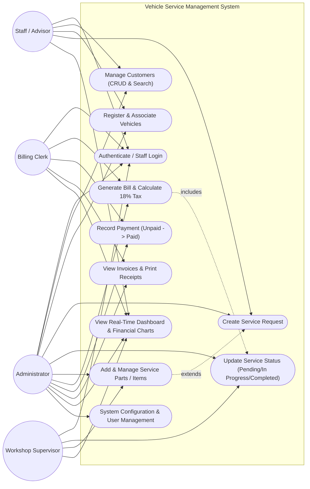

# Use Case Diagram: Vehicle Service Management System

## Overview
This diagram depicts the primary actors (Staff Member, Workshop Supervisor, Billing Clerk, and Administrator) interacting with the system's core capabilities.

## Description of Primary Use Cases
1. **Authenticate / Staff Login (UC1)**: Users verify identity with username and password. Invalid attempts display sanitized notifications.
2. **Customer Management (UC2)**: Service advisors register customer contact information with phone and email validation.
3. **Vehicle Registration (UC3)**: Vehicles are registered under an owner with uniqueness checks on registration plates.
4. **Create Service Request (UC4)**: Opens a new job ticket with initial issue descriptions and estimated labor cost.
5. **Update Service Status (UC5)**: Advances the service lifecycle from Pending through In Progress to Completed.
6. **Manage Spare Parts / Items (UC6)**: Technicians attach replacement components with quantities and unit prices.
7. **Generate Bill (UC7)**: Automatically computes parts sum, labor, 18% GST, and total. Guarded to require Completed service.
8. **Record Payment (UC8)**: Transitions unpaid invoices to Paid upon receiving settlement from customer.
9. **Dashboard & Financial Charts (UC10)**: Displays aggregated operational metrics and dynamic JavaFX visual charts.
