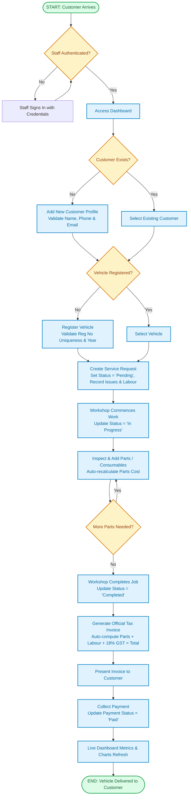

# Workflow Diagram: Vehicle Service Management System

## Core Business Workflow
This diagram illustrates the step-by-step end-to-end lifecycle of a vehicle through the workshop, from customer arrival to final payment settlement.

